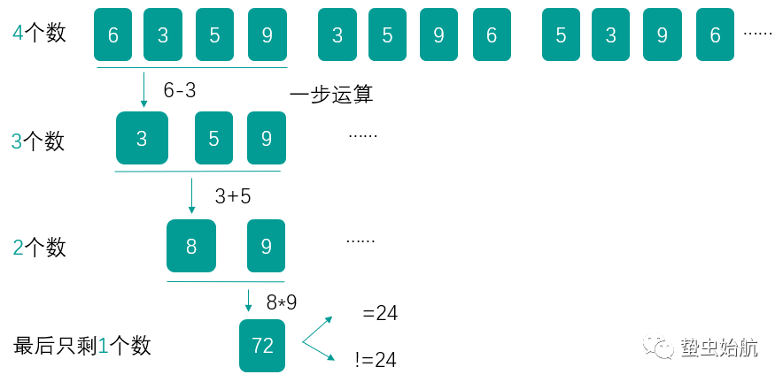

# 1.题目
你有 4 张写有 1 到 9 数字的牌。你需要判断是否能通过 `*，/，+，-，(，) `的运算得到 24。
<pre>
示例 1:
输入: [4, 1, 8, 7]
输出: True
解释: (8-4) * (7-1) = 24

示例 2:
输入: [1, 2, 1, 2]
输出: False
</pre>

注意：
1）除法运算符 `/` 表示实数除法，而不是整数除法。例如 `4 / (1 - 2/3) = 12`。（因此结果为浮点数，列表中存储的数字也都是浮点数。在判断结果是否等于 24 时应考虑精度误差，这道题中，误差小于 `10^(-6)`可以认为是相等。）
2）每个运算符对两个数进行运算。特别是我们不能用 `-` 作为一元运算符。例如，[1, 1, 1, 1] 作为输入时，表达式-1 - 1 - 1 - 1是不允许的。
3）你不能将数字连接在一起。例如，输入为[1, 2, 1, 2]时，不能写成 12 + 12。

# 2.解析

## 2.1 方法一：回溯
在24点游戏中，总共有$A^2_4 * 4 * A^2_3 * 4 * A^2_2 * 4 = 9126$种情况，最简单的方式就是枚举验证所有满足运算结果为24的一列数。
<pre>
首先解释下为什么是9126种情况。一共有4个数和4个运算操作，首先从4个数字中有序地选出2个数字，共有4×3=12种选法，并选择加、减、乘、除4种运算操作之一，用得到的结果取代选出的2个数字，剩下3个数字。

然后在剩下的3个数字中有序地选出2个数字，共有3×2=6种选法，并选择4种运算操作之一，用得到的结果取代选出的2个数字，剩下2个数字。

最后剩下2个数字，有2种不同的顺序，并选择4种运算操作之一。

因此，一共有12×4×6×4×2×4=9216种不同的可能性。
</pre>

可以通过回溯的方法遍历所有不同的可能性。具体做法是，使用一个列表存储目前的全部数字，每次从列表中选出2个数字，再选择一种运算操作，用计算得到的结果取代选出的2个数字，这样列表中的数字就减少了1个。重复上述步骤，直到列表中只剩下1个数字，这个数字就是一种可能性的结果，如果结果等于24，则说明可以通过运算得到24。如果所有的可能性的结果都不等于24，则说明无法通过运算得到24。
<pre>
这里解释下回溯的基本思路以及伪码实现，以下伪码即为回溯的思路实现：
result = []
def backtrack(路径, 选择列表):
    if 满足结束条件:
        result.add(路径)
        return

    for 选择 in 选择列表:
        做选择
        backtrack(路径, 选择列表)
        撤销选择
代入到这道题来看，路径就代表全部的数字（例如[1, 2, 1, 2]），选择列表就是指4个运算符列表，结束条件就是指四个路径/数字选择完毕且最终结果等于24，最后将该计算式装入结果数组中。
</pre>

具体来看如何去做回溯，
1) 判断4个数字是否能得到24是比较复杂的，但是两个数字通过四则运算是否能得到24就相当容易了，因此解决此问题的关键在于怎样把4个数字变成3个数字，再变成两个数字。
2) 4->3: 从4个数字中任取两个（6种可能）进行四则运算，得到五个值分别与剩下的两个数字组合，得到三个数；
3) 3->2: 从3个数字中任取两个（3种可能）进行四则运算，得到的五个值分别与剩下的一个数字组合，得到两个数；
4) 2->结果：将两个数字进行四则运算，若可以得到24，返回true。

下图是回溯过程的图示：




```c++
class Solution {
public:
    static constexpr int TARGET = 24;
    static constexpr double EPSILON = 1e-6;
    static constexpr int ADD = 0, MULTIPLY = 1, SUBTRACT = 2, DIVIDE = 3;

    bool judgePoint24(vector<int> &nums) {
        vector<double> l;
        for (const int &num : nums) {
            l.emplace_back(static_cast<double>(num));
        }
        return solve(l);
    }

    bool solve(vector<double> &l) {
        if (l.size() == 0) {
            return false;
        }
        if (l.size() == 1) {
            return fabs(l[0] - TARGET) < EPSILON;
        }
        int size = l.size();
        for (int i = 0; i < size; i++) {
            for (int j = 0; j < size; j++) {
                if (i != j) {
                    vector<double> list2 = vector<double>();
                    //选择列表
                    for (int k = 0; k < size; k++) {
                        if (k != i && k != j) {
                            list2.emplace_back(l[k]);
                        }
                    }
                    // backtrack
                    for (int k = 0; k < 4; k++) {
                        if (k < 2 && i > j) {
                            continue;
                        }
                        if (k == ADD) {
                            list2.emplace_back(l[i] + l[j]);
                        } else if (k == MULTIPLY) {
                            list2.emplace_back(l[i] * l[j]);
                        } else if (k == SUBTRACT) {
                            list2.emplace_back(l[i] - l[j]);
                        } else if (k == DIVIDE) {
                            if (fabs(l[j]) < EPSILON) {
                                continue;
                            }
                            list2.emplace_back(l[i] / l[j]);
                        }
                        //满足结束条件
                        if (solve(list2)) {
                            return true;
                        }
                        //撤销选择
                        list2.pop_back();
                    }
                }
            }
        }
        return false;
    }
};
```

- 时间复杂度：O(1)。一共有 9216 种可能性，对于每种可能性，各项操作的时间复杂度都是 O(1)，因此总时间复杂度是 O(1)。

- 空间复杂度：O(1)。空间复杂度取决于递归调用层数与存储中间状态的列表，因为一共有 4 个数，所以递归调用的层数最多为 4，存储中间状态的列表最多包含 4 个元素，因此空间复杂度为常数。

