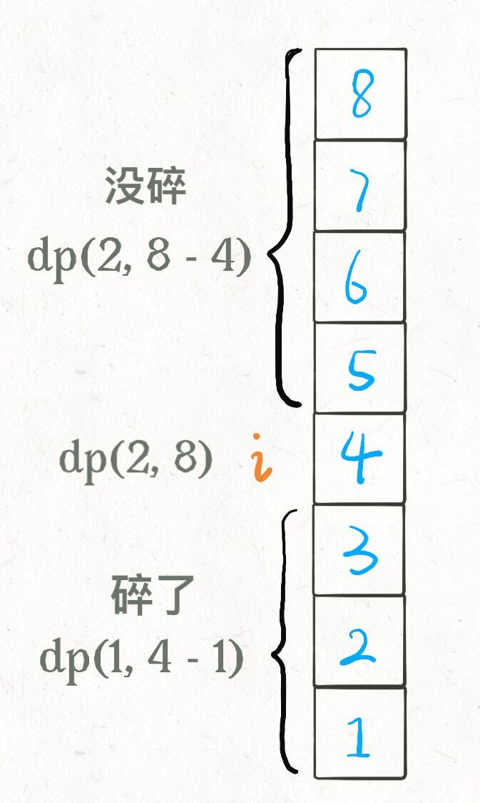
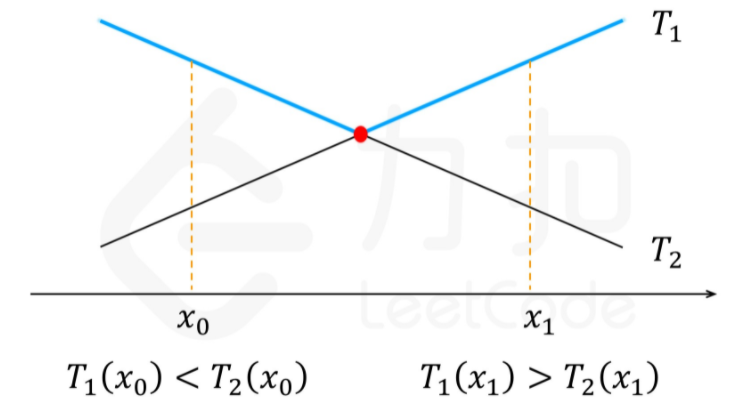

# 1. 题目
如果你有2颗鸡蛋，和一栋100层高的楼，现在你想知道在哪一层楼之下，鸡蛋不会被摔碎，应该如何用最少的测试次数对于任何答案楼层都能够使问题得到解决。

- 如果你从某一层楼扔下鸡蛋，它没有碎，则这个鸡蛋你可以继续用
- 如果这个鸡蛋摔碎了，则你可以用来测试的鸡蛋减少一个
- 所有鸡蛋的质量相同（都会在同一楼层以上摔碎）
- 对于一个鸡蛋，如果其在楼层$i$扔下的时候摔碎了，对于任何不小于$i$的楼层，这个鸡蛋都会被摔碎
- 如果在楼层i扔下的时候没有摔碎，则对于任何不大于$i$的楼层，这颗鸡蛋也不会摔碎
- 从第1层扔下，鸡蛋不一定完好，从第36层扔下，鸡蛋也不一定会摔碎。

<pre>
示例 1：
输入：k = 1, n = 2
输出：2
解释：鸡蛋从 1 楼掉落。如果它碎了，肯定能得出 f = 0 。 否则，鸡蛋从 2 楼掉落。如果它碎了，肯定能得出 f = 1 。 
如果它没碎，那么肯定能得出 f = 2 。 因此，在最坏的情况下我们需要移动 2 次以确定 f 是多少。 

示例 2：
输入：k = 2, n = 6
输出：3

示例 3：
输入：k = 3, n = 14
输出：4
</pre>

# 2. 解析
实际上，我们的终极目的是要找出连续的两层楼$i，i+1$在楼层$i$鸡蛋没有摔碎，在楼层$i+1$鸡蛋碎了。问题的关键之处在于，测试之前，你并不知道鸡蛋会在哪一层摔碎，你需要找到的是一种测试方案，这种测试方案，无论鸡蛋会在哪层被摔碎，都至多只需要$m$次测试，在所有这些测试方案中，$m$的值最小。

对于只有1颗鸡蛋的情况，我们别无选择，采用线性扫描的方式。只能从1楼开始，逐层向上测试，直到第$i$层鸡蛋摔碎为止，这时我们知道，会让鸡蛋摔碎的楼层就是$i$(或者直到顶层，鸡蛋也没有被摔碎)。其他的测试方案均不可行，因为如果第1次测试是在任何$i>1$的楼层扔下鸡蛋，如果鸡蛋碎了，你就无法确定，$i-1$层是否也会令鸡蛋摔碎。所以对于1颗鸡蛋而言，最坏的情况是使鸡蛋摔碎的楼层数$i>=36$，此时，我们需要测试每个楼层，总共36次，才能找到最终结果，所以1颗鸡蛋一定能解决36层楼问题的最少测试次数是36。

对于2个鸡蛋，36层楼的情况，你可能会考虑先在第18层扔一颗，如果这颗碎了，则你从第1层，到第17层，依次用第2颗鸡蛋测试，直到找出答案。如果第1颗鸡蛋没碎，则你依然可以用第1颗鸡蛋在27层进行测试，如果碎了，在第19～26层，用第2颗鸡蛋依次测试，如果没碎，则用第1颗鸡蛋在32层进行测试，如此进行（有点类似于二分查找）。这个解决方案的最坏情况出现在结果是第17/18层时，此时，你需要测试18次才能找到最终答案，所以该方案，解决36层楼问题的测试次数是18。相较于1颗鸡蛋解决36层楼问题，测试次数实现了减半。

还有种优化的方式是我们手中有两个鸡蛋，尝试使每个鸡蛋的测试任务大致相当，即给100开个平方根，第一个鸡蛋只测试整十楼层，第二个鸡蛋测试两个整十楼层之间的楼层。我们可以先测10楼，20楼，30楼···，直到第一个鸡蛋碎掉。如果我们测到30楼，第一个鸡蛋碎了，那我们就用第二个鸡蛋遍历测试21~29楼。这种策略最糟糕的情况会是99层是临界楼层，测试次数是10+9=19次。最好的情况是1楼是临界楼层，测试次数是1+2=3次。

实际上，如果不限制鸡蛋个数的话，二分思路显然可以得到最少尝试的次数，但问题是，现在给你了鸡蛋个数的限制 K，直接使用二分思路就不行了。

由于要制定一种泛化的策略，所以我们通过观察可以发现。第一颗鸡蛋的测试次数$x$，用来缩小范围；第二颗鸡蛋用来在小范围内查找临界楼层$y$；即$x+y=n$。那么当测试次数固定为$n$时，每当$x$增加1，$y$则减少1（如果n=10,那么第一次探查了20楼，使用了一次机会，如果碎了，确定的范围是1\~19，那么，第二颗鸡蛋需要使用10-1=9次机会去探查19层，在最糟糕的情形下显然无法完成。显然当n=10时，第一次探查为10楼显然更合适，确定下来的范围是1~9，第二颗鸡蛋使用10-1次探查9层楼，最糟糕的情形下也能满足）；即每当第一颗鸡蛋测试一次，那么所留给第二颗鸡蛋探查的范围就应该减少1。将探查范围相加起来，再加上n就是探查的总范围，即n+(n-1)+...+0 = 100 (100为探测的总范围)。解的$n$刚好为正整数14，即使用此策略最多探查14次即可在100楼中找到临界楼层。另外，当探查总范围发生改变时，解的$n$可能为小数，显然探查次数只能为整数且$n$越小探查总范围越小，即$n$应向上取整。

**熟悉动态规划的同学，都应该知道这是一道典型的动态规划题目。**

我们可以考虑使用动态规划来做这道题，动态规划的框架是这个问题有什么「状态」，有什么「选择」，然后穷举。

**状态**就是当前拥有的鸡蛋数 K 和需要测试的楼层数 N，可以表示成$(k,n)$，其中$k$为鸡蛋数，$n$为楼层数。当我们从第$x$楼扔鸡蛋的时候
- 如果鸡蛋不碎，那么状态变成$(k,n−x)$，即我们鸡蛋的数目不变，但答案只可能在上方的 $n-x$层楼了。也就是说，我们把原问题缩小成了一个规模为$(k,n−x)$的子问题
- 如果鸡蛋碎了，那么状态变成$(k−1,x−1)$，即我们少了一个鸡蛋，但我们知道答案只可能在第 $x$ 楼下方的$x-1$层楼中了。也就是说，我们把原问题缩小成了一个规模为$(k−1,x−1)$的子问题。

一个简单的示例如下：


这样一来，我们定义$dp(k,n)$为在状态$(k, n)$下最少需要的步数。根据以上分析我们可以列出状态转移方程：
$dp(k, n)=1+\min _{1 \leq x \leq n}(\max (dp(k-1, x-1), dp(k, n-x)))$

**选择**其实就是去选择哪层楼扔鸡蛋。回顾刚才的线性扫描和二分思路，二分查找每次选择到楼层区间的中间去扔鸡蛋，而线性扫描选择一层层向上测试。不同的选择会造成状态的转移

最后就是要知道动态规划里最基础的状态是什么，当楼层数 N 等于 0 时，显然不需要扔鸡蛋；当鸡蛋数 K 为 1 时，显然只能线性扫描所有楼层。

如果我们直接暴力转移求解每个状态的$dp$值，时间复杂度是为 $O(kn^2)$，即一共有$O(kn)$个状态，对于每个状态枚举扔鸡蛋的楼层x，需要$O(n)$的时间。这无疑在当前数据范围下是会超出时间限制的，因此我们需要想办法优化枚举的时间复杂度。

我们观察到$dp(k, n)$是一个关于$n$的单调递增函数, 第一项$dp(k-1, x-1)$是一个随$x$的增加而单调递增的函数，第二项$dp(k, n-x)$是一个随着$x$的增加而单调递减的函数。那么必然第一项和第二项存在一个交点保证这两个函数相交。在这种情况下，我们需要找到最大的满足$dp(k-1, x-1) < dp(k, n-x)$的最大$x$值，以及最小满足$dp(k-1, x-1) > dp(k, n-x)$的最小$x$值。我们比较两个$x$所对应的函数值，取其中的最小值（因为$min_{1 \leq x \leq n}$）作为最后的$x$值。我们采用二分查找的方式，最终时间复杂度从$O(kn^2)$降低至$O(knlogn)$。



```c++
class Solution {
    unordered_map<int, int> memo;
    int dp(int k, int n) {
        if (memo.find(n * 100 + k) == memo.end()) {
            int ans;
            if (n == 0) {
                ans = 0;
            } else if (k == 1) {
                ans = n;
            } else {
                int lo = 1, hi = n;
                while (lo + 1 < hi) {
                    int x = (lo + hi) / 2;
                    int t1 = dp(k - 1, x - 1);
                    int t2 = dp(k, n - x);

                    if (t1 < t2) {
                        lo = x;
                    } else if (t1 > t2) {
                        hi = x;
                    } else {
                        lo = hi = x;
                    }
                }

                ans = 1 + min(max(dp(k - 1, lo - 1), dp(k, n - lo)),
                                   max(dp(k - 1, hi - 1), dp(k, n - hi)));
            }

            memo[n * 100 + k] = ans;
        }

        return memo[n * 100 + k];
    }
public:
    int superEggDrop(int k, int n) {
        return dp(k, n);
    }
};
```
- 时间复杂度：$O(knlogn)$。我们需要计算$O(kn)$个状态，每个状态计算时需要 $O(logn)$ 的时间进行二分查找。
- 空间复杂度：$O(kn)$。我们需要 $O(kn)$ 的空间存储每个状态的解。
