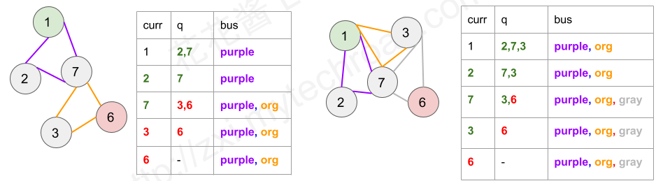

# 1. 题目
给你一个数组 `routes` ，表示一系列公交线路，其中每个 `routes[i]` 表示一条公交线路，第 `i` 辆公交车将会在上面循环行驶。

例如，路线 `routes[0] = [1, 5, 7]` 表示第 `0` 辆公交车会一直按序列 `1 -> 5 -> 7 -> 1 -> 5 -> 7 -> 1 -> ...` 这样的车站路线行驶。
现在从 source 车站出发（初始时不在公交车上），要前往 `target` 车站。 期间仅可乘坐公交车。

求出 最少乘坐的公交车数量 。如果不可能到达终点车站，返回 -1 。

<pre>
示例 1：
输入：routes = [[1,2,7],[3,6,7]], source = 1, target = 6
输出：2
解释：最优策略是先乘坐第一辆公交车到达车站 7 , 然后换乘第二辆公交车到车站 6 。 

示例 2：
输入：routes = [[7,12],[4,5,15],[6],[15,19],[9,12,13]], source = 15, target = 12
输出：-1
</pre>

# 2. 解析
下图是示例的图的构建形式，采用邻接表来表示图的邻居节点，不同的颜色表示不同的公交汽车。




本题首先不要管车站(station)，我们只在乎公交路线(route)。我们可以将每一条线路视作一个点，对于任意两条线路，如果它们经过的车站有交集，那么就在两点之间连一条边，这样就构成了一张图。这是否会让人联想到DFS或者BFS呢？

图中有些点（路线）是包含起点 $S$ 的，我们把它们都作为起点。而有些点（路线）是包含终点 $T$ 的，我们把它们都作为终点。

那么问题就转化为了求起点到终点的最短路径。因为起点和终点数量可能有多个，所以我们新建两个结点，一个起点用来指向所有包含 $S$ 的点，一个终点用来指向所有包含 $T$ 的点。接下来问题就变成了单源最短路径问题了。

由于是求最短距离，我们首先应该考虑BFS，伪码如下
```c++
int numBusesToDestination(vector<vector<int>>& routes, int source, int target) {
    queue<Node> q;
    vector<bool> visited;
    q.push(起点路线);
    while (!q.empty()) {
        取出一个节点；
        判断是否访问过；
        设置访问；
        判断是否是终点，如果是就返回答案。
        for (所有和这个节点关联的节点) {
            if(这个节点还没访问过) {
                q.push(这个节点);
            }
        }
    }
    return -1;
}
```
我们应该要找到经过某一站点的所有的路线，只要经过同一个站点，那这些路线就是相连接的。因此，用`unordered_map<int, vector<int>> stationToRoute`来存储经过站点的所有路线的数据，key代表站点,value代表经过此站点所有的路线。遍历所有的routes，把经过同一站点的路线们都记录下来。
```c++
unordered_map<int, vector<int> > stationToRoute;
for (int i = 0; i < routes.size(); i++) {
    for (int j = 0; j < routes[i].size(); j++) {
        stationToRoute[routes[i][j]].push_back(i);
    }
}
```

接下来，通过这一数据结构，我们来构建我们的图。遍历哈希表中所有的key，把一个value中所有的路线相连接。
```c++
for (auto &p : stationToRoute) {
    for (auto &route : p.second) {
        for (auto &secondRoute : p.second) {
            if (secondRoute != route) {
                routeToRoutes[route].push_back(secondRoute);
            }   
        }
    }
}
```
我们同样可以通过`stationToRoute[source`]以及`stationToRoute[target]`来找到所有的起始路线以及终止路线。最后，我们可以通过`queue<pair<int, int>>`的方法，来同时记录路线以及之前所经过的路线数量。


综上，代码如下：
```c++
class Solution {
public:
    int numBusesToDestination(vector<vector<int>>& routes, int source, int target) {
        // 会有XX不上公交车...起点就是终点...
        if (source == target) {return 0;}
        // 先遍历所有的路线中的站台，把每个站台所能路过的路线都记录下来
        unordered_map<int, vector<int> > stationToRoute;
        for (int i = 0; i < routes.size(); i++) {
            for (int j = 0; j < routes[i].size(); j++) {
                stationToRoute[routes[i][j]].push_back(i);
            }
        }
        // 再遍历所有站台，根据站台经过的路线，来建立路线之间的关系
        vector<vector<int> > routeToRoutes(500, vector<int>(0));
        for (auto &p : stationToRoute) {
            for (auto &route : p.second) {
                for (auto &secondRoute : p.second) {
                    if (secondRoute != route) {
                        routeToRoutes[route].push_back(secondRoute);
                    }   
                }
            }
        }

        unordered_set<int> endRoutes;
        for (auto &route : stationToRoute[target]) {
            endRoutes.insert(route);
        }

        vector<bool> visited(500, false);

        // 首先得有一个queue可以存档node和一些信息
        // <第几个route, 上过几辆车了>
        queue<pair<int, int> > q;
        for (auto &route : stationToRoute[source]) {
            q.push({route, 0});
        }
        while (!q.empty()) {
        // 取出queue元素
            auto tmp = q.front();
            q.pop();
        // 如果访问过了，就continue;
        // 再设置一下visited
            if(visited[tmp.first]) {
                continue;
            }
        // 没访问过，就看看是不是终点
            visited[tmp.first] = true;
            if (endRoutes.find(tmp.first) != endRoutes.end()) {
                return tmp.second + 1;
            }
            for (auto &route : routeToRoutes[tmp.first]) {
                // 对于所所有下个可能，入queue
                if (!visited[route]) {
                    q.push({route, tmp.second + 1});
                }
            }
        }
        return -1;
    }
};
```

复杂度分析：
- 时间复杂度：假设路线数量是 $N$，每条路线最多有 $M$ 个车站。那么排序复杂度为 $O(NMlogM)$，建图复杂度为 $O(N^2M)$，BFS 复杂度为 O(N^2)。因此总的时间复杂度忽略低阶项之后为 $O(N^2M)$。
- 空间复杂度：$O(N^2)$
