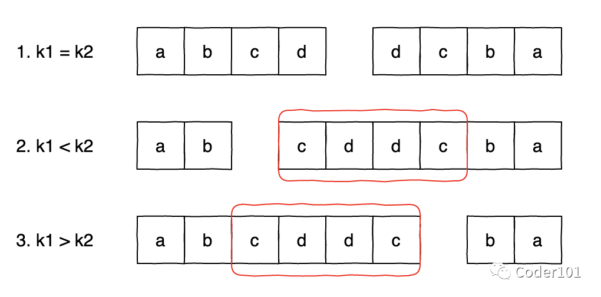
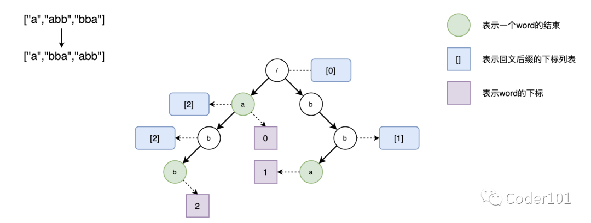

# 1. 题目
给定一组互不相同的单词， 找出所有不同的索引对 (i, j)，使得列表中的两个单词， `words[i] + words[j]` ，可拼接成回文串。
<pre>
示例 1：
输入：words = ["abcd","dcba","lls","s","sssll"]
输出：[[0,1],[1,0],[3,2],[2,4]] 
解释：可拼接成的回文串为 ["dcbaabcd","abcddcba","slls","llssssll"]

示例 2：
输入：words = ["bat","tab","cat"]
输出：[[0,1],[1,0]] 
解释：可拼接成的回文串为 ["battab","tabbat"]

示例 3：
输入：words = ["a",""]
输出：[[0,1],[1,0]]
</pre>

# 2. 解析

本题可以使用暴力做法，即美剧每一对字符串的组合，暴力判断他们是否能够构成回文串，时间复杂度$O(n^2*m)$，其中$n$是字符串数量，$m$是字符串平均长度。但是很显然，这样的时间复杂度在实际工程中效率很低。

假设存在两个字符串$s_1$和$s_2$，$s_1+s_2$是一个回文串，其中两个字符串的长度分别为$len_1$和$len_2$：
1）如果$len_1=len_2$, 那么$s_1$是$s_2$的翻转。
2）如果$len_1>len_2$，这种情况下可以将$s_1$拆分成两部分$t_1$和$t_2$，其中$t_1$是$s_2$的翻转，$t_2$是一个回文串
3）如果$len_1 < len_2$, 这种情况下将$s_2$拆分成两部分$t_1$和$t_2$, 其中$t_2$是$s_1$的翻转，$t_1$是一个回文串


所以，当面对两个字符串，可以将两个字符串中较长的那一个拿出来，拆分成两部分，$t_1$和$t_2$：
- 当$t_1$是回文串的时候，符合情况3），只需要去检验$t_2$字符串是否包含翻转
- 当$t_2$是回文串的时候，符合情况2），只需要去检验$t_1$字符串是否包含翻转

所以，这就相当于要对每一个字符串都查询是否包含有回文串，然后将剩余的部分翻转并和其他字符串相匹配。对此，有两种实现方法：
- 我们可以使用字典树存储所有的字符串。在进行查询时，我们将待查询串的子串逆序地在字典树上进行遍历，即可判断其是否存在。
- 我们可以使用哈希表存储所有字符串的翻转串。在进行查询时，我们判断带查询串的子串是否在哈希表中出现，就等价于判断了其翻转是否存在。

其中字典树又称单词查找树、前缀树，是一种树形结构，利用字符串的公共前缀来减少查询时间，最大限度地减少无谓的字符串比较，比哈希表更快。根节点不包含字符，除根节点外每个节点都只包含一个字符；从根节点到某一节点，路径上经过的字符连接起来，为该节点对应的字符串；每个节点的所有子节点包含的字符都不相同。

一个简单的示例如下：
1)构建字典树

2）查找字符串"a"


所以，思路如下：
- 构建
    - 字符串取反；
    - 遍历word，创建节点；
    - word.substring(j+1)为回文，则添加到该节点的suffixs列表中；这里要注意word本身为回文则添加到root节点的suffixs列表中；
- 查找
    - 遍历word；
    - 如果word.substring(j)为回文，则要看当前节点是否为一个单词，如果是，添加到结果中；对应情况3）
    - word遍历结束且有以word结尾的单词，则要看当前节点的suffixs列表；对应情况2）

```c++
class Solution {
public:
    struct node {
        int ch[26];
        int flag;
        node() {
            flag = -1;
            memset(ch, 0, sizeof(ch));
        }
    };

    vector<node> tree;

    void insert(string& s, int id) {
        int len = s.length(), add = 0;
        for (int i = 0; i < len; i++) {
            int x = s[i] - 'a';
            if (!tree[add].ch[x]) {
                tree.emplace_back();
                tree[add].ch[x] = tree.size() - 1;
            }
            add = tree[add].ch[x];
        }
        tree[add].flag = id;
    }

    int findWord(string& s, int left, int right) {
        int add = 0;
        for (int i = right; i >= left; i--) {
            int x = s[i] - 'a';
            if (!tree[add].ch[x]) {
                return -1;
            }
            add = tree[add].ch[x];
        }
        return tree[add].flag;
    }

    bool isPalindrome(string& s, int left, int right) {
        int len = right - left + 1;
        for (int i = 0; i < len / 2; i++) {
            if (s[left + i] != s[right - i]) {
                return false;
            }
        }
        return true;
    }

    vector<vector<int>> palindromePairs(vector<string>& words) {
        tree.emplace_back(node());
        int n = words.size();
        for (int i = 0; i < n; i++) {
            insert(words[i], i);
        }
        vector<vector<int>> ret;
        for (int i = 0; i < n; i++) {
            int m = words[i].size();
            for (int j = 0; j <= m; j++) {
                if (isPalindrome(words[i], j, m - 1)) {
                    int left_id = findWord(words[i], 0, j - 1);
                    if (left_id != -1 && left_id != i) {
                        ret.push_back({i, left_id});
                    }
                }
                if (j && isPalindrome(words[i], 0, j - 1)) {
                    int right_id = findWord(words[i], j, m - 1);
                    if (right_id != -1 && right_id != i) {
                        ret.push_back({right_id, i});
                    }
                }
            }
        }
        return ret;
    }
};
```

哈希表
```c++
class Solution {
private:
    vector<string> wordsRev;
    unordered_map<string_view, int> indices;

public:
    int findWord(const string_view& s, int left, int right) {
        auto iter = indices.find(s.substr(left, right - left + 1));
        return iter == indices.end() ? -1 : iter->second;
    }

    bool isPalindrome(const string_view& s, int left, int right) {
        int len = right - left + 1;
        for (int i = 0; i < len / 2; i++) {
            if (s[left + i] != s[right - i]) {
                return false;
            }
        }
        return true;
    }

    vector<vector<int>> palindromePairs(vector<string>& words) {
        int n = words.size();
        for (const string& word: words) {
            wordsRev.push_back(word);
            reverse(wordsRev.back().begin(), wordsRev.back().end());
        }
        for (int i = 0; i < n; ++i) {
            indices.emplace(wordsRev[i], i);
        }

        vector<vector<int>> ret;
        for (int i = 0; i < n; i++) {
            int m = words[i].size();
            if (!m) {
                continue;
            }
            string_view wordView(words[i]);
            for (int j = 0; j <= m; j++) {
                if (isPalindrome(wordView, j, m - 1)) {
                    int left_id = findWord(wordView, 0, j - 1);
                    if (left_id != -1 && left_id != i) {
                        ret.push_back({i, left_id});
                    }
                }
                if (j && isPalindrome(wordView, 0, j - 1)) {
                    int right_id = findWord(wordView, j, m - 1);
                    if (right_id != -1 && right_id != i) {
                        ret.push_back({right_id, i});
                    }
                }
            }
        }
        return ret;
    }
};
```
- 时间复杂度：$O(n*m^2)$，其中$n$是字符串的数量，$m$是字符串的平均长度。对于每一个字符串，我们需要$O(m^2)$地判断其所有前缀与后缀是否是回文串，并$O(m^2)$地寻找其所有前缀与后缀是否在给定的字符串序列中出现。
- 空间复杂度：$O(n×m)$，其中 n 是字符串的数量，m 是字符串的平均长度为字典树的空间开销。

