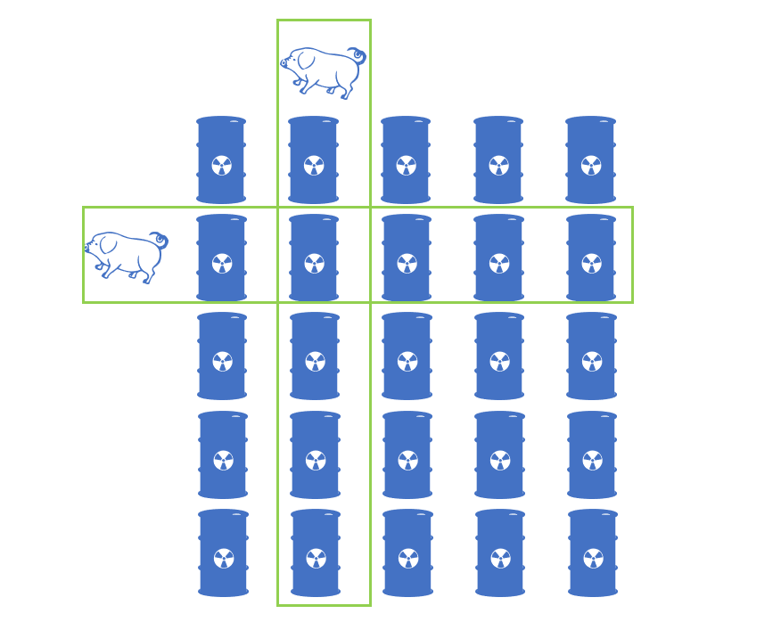
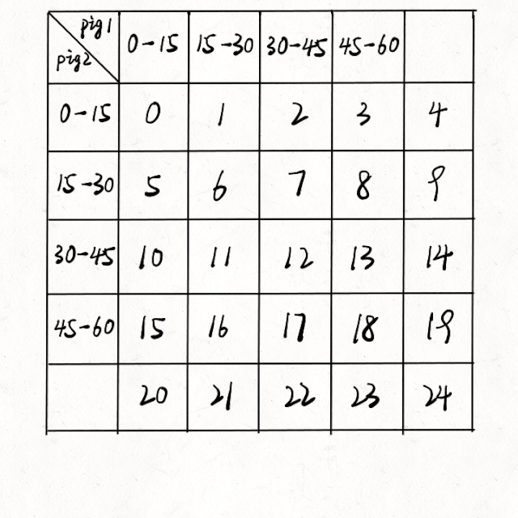

# 1. 题目
有 buckets 桶液体，其中正好有一桶含有毒药，其余装的都是水。它们从外观看起来都一样。为了弄清楚哪只水桶含有毒药，你可以喂一些猪喝，通过观察猪是否会死进行判断。不幸的是，你只有 minutesToTest 分钟时间来确定哪桶液体是有毒的。

喂猪的规则如下：
- 选择若干活猪进行喂养
- 可以允许小猪同时饮用任意数量的桶中的水，并且该过程不需要时间。
- 小猪喝完水后，必须有 minutesToDie 分钟的冷却时间。在这段时间里，你只能观察，而不允许继续喂猪。
- 过了 minutesToDie 分钟后，所有喝到毒药的猪都会死去，其他所有猪都会活下来。
- 重复这一过程，直到时间用完。

给你桶的数目 buckets ，minutesToDie 和 minutesToTest ，返回在规定时间内判断哪个桶有毒所需的最小猪数。
<pre>
示例 1：
输入：buckets = 1000, minutesToDie = 15, minutesToTest = 60
输出：5

示例 2：
输入：buckets = 4, minutesToDie = 15, minutesToTest = 15
输出：2

示例 3：
输入：buckets = 4, minutesToDie = 15, minutesToTest = 30
输出：2
</pre>

# 2. 解析
举例说明：

假设：总时间 minutesToTest = 60，死亡时间 minutesToDie = 15，pow(x, y) 表示 x 的 y 次方，ceil(x)表示 x 向上取整
当前有只小猪，最多可以喝 times = minutesToTest / minutesToDie = 4 次水
最多可以喝 4 次水，能够携带 base = times + 1 = 5 个的信息量，也就是（便于理解从 0 开始）：
(1) 喝 0 号死去，0 号桶水有毒
(2) 喝 1 号死去，1 号桶水有毒
(3) 喝 2 号死去，2 号桶水有毒
(4) 喝 3 号死去，3 号桶水有毒
(5) 喝了上述所有水依然活蹦乱跳，4 号桶水有毒

结论是 1 只小猪最多能够验证 5 桶水中哪只水桶含有毒，当 buckets ≤ 5 时，answer = 1。那么 2 只小猪可以验证的范围最多到多少呢？我们把每只小猪携带的信息量看成是 base进制数，2 只小猪的信息量就是 pow(base, 2) = pow(5, 2) = 25，所以当 5 ≤ buckets ≤ 25时，anwser = 2。那么可以得到公式关系：pow(base, ans) ≥ buckets，取对数后即为：ans ≥ log(buckets) / log(base)，因为 ans 为整数，所以 ans = ceil(log(buckets) / log(base))


那小猪到底是如何喂水的呢？下面这个动态图可以介绍整个喂水的过程：



```c++
class Solution {
public:
    int poorPigs(int buckets, int minutesToDie, int minutesToTest) {
        int states = minutesToTest / minutesToDie + 1;
        return ceil(log(buckets) / log(states));
    }
};
```
