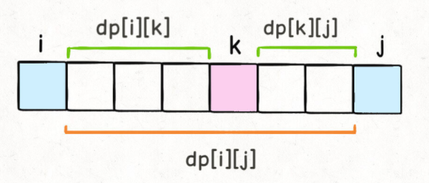
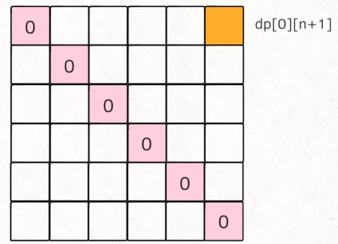
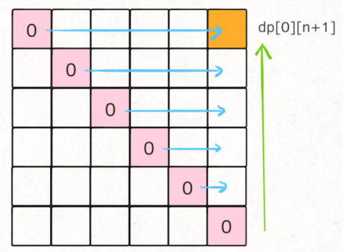

# 1. 题目
有 n 个气球，编号为 `0` 到 `n - 1`，每个气球上都标有一个数字，这些数字存在数组 nums 中。

现在要求你戳破所有的气球。戳破第 `i` 个气球，你可以获得 `nums[i - 1] * nums[i] * nums[i + 1] `枚硬币。 这里的 `i - 1` 和 `i + 1` 代表和 `i` 相邻的两个气球的序号。如果 `i - 1`或 `i + 1` 超出了数组的边界，那么就当它是一个数字为 1 的气球。

求所能获得硬币的最大数量。

<pre>
示例 1：
输入：nums = [3,1,5,8]
输出：167
解释：
nums = [3,1,5,8] --> [3,5,8] --> [3,8] --> [8] --> []
coins =  3*1*5    +   3*5*8   +  1*3*8  + 1*8*1 = 167

示例 2：
输入：nums = [1,5]
输出：10
</pre>

# 2. 解析
涉及求最值的问题，首先想到的就是穷举所有可能的结果，然后对比得出最值。

穷举主要有两种算法，就是回溯算法和动态规划。

## 2.1 回溯算法
如果采用回溯算法，那其实就是穷举戳气球的顺序，不同的戳气球顺序可能得到不同的分数，然后将最高的那个分数找出来。伪码如下：
```c++
int res = Integer.MIN_VALUE;
/* 输入一组气球，返回戳破它们获得的最大分数 */
int maxCoins(int[] nums) {
    backtrack(nums, 0); 
    return res;
}
/* 回溯算法的伪码解法 */
void backtrack(int[] nums, int socre) {
    if (nums 为空) {
        res = max(res, score);
        return;
    }
    for (int i = 0; i < nums.length; i++) {
        int point = nums[i-1] * nums[i] * nums[i+1];
        int temp = nums[i];
        // 做选择
        在 nums 中删除元素 nums[i]
        // 递归回溯
        backtrack(nums, score + point);
        // 撤销选择
        将 temp 还原到 nums[i]
    }
}
```
但显然，算法的效率并不高，时间复杂度是阶乘级别的。

## 2.2 动态规划
此处问题有一点很关键在于：每戳破一个气球 `nums[i]`，得到的分数和该气球相邻的气球 `nums[i-1]` 和 `nums[i+1]` 是有相关性的。

首先，要想清楚如何定义这个子问题，也就是如何定义dp数组。对于题目中的`nums[-1] = nums[n] = 1`，我们先将边界加进去，
```c++
int maxCoins(int[] nums) {
    int n = nums.length;
    // 两端加入两个虚拟气球
    int[] points = new int[n + 2];
    points[0] = points[n + 1] = 1;
    for (int i = 1; i <= n; i++) {
        points[i] = nums[i - 1];
    }
    // ...
}
```
现在的气球索引变成了从`1`到`n`，`points[0]`和`points[n+1]`可以认为是两个虚拟气球。那么问题转化为，在一排气球points当中，戳破`0`到`n+1`之间的所有气球。能够得到多少分？

那么，dp数组的含义可以定义为：`dp[i][j] = x` 表示，戳破气球 `i` 和气球 `j` 之间（开区间，不包括 i 和 j）的所有气球，可以获得的最高分数为 x。

最终需要得到的结果是`dp[0][n+1]`的值，basecase是`dp[i][j] = 0，0 <= i <= n+1, j <= i+1`，再次情况下，开区间`(i, j)`根本没有气球可以戳。

接下来要确定状态转移方程，我们假定最后一个戳破的气球为k，那么`dp[i][j]`的值就应该为
`dp[i][j] = dp[i][k] + dp[k][j] + points[i]*points[k]*points[j]`
如果要最后戳破气球`k`，那得先把开区间`(i, k)`气球都戳破(得到的分数为`dp[i][k]`)，再把开区间`(k, j)`的气球都戳破（得到的分数为`dp[k][j]`）；剩下的气球`k`，相邻的就是气球`i`和气球`j`，这时候戳破`k`的话得到的分数就是`points[i]*points[k]*points[j]`。



所以最后的状态转移方程：
```c++
// 最后戳破的气球是哪个？
for (int k = i + 1; k < j; k++) {
    // 择优做选择，使得 dp[i][j] 最大
    dp[i][j] = Math.max(
        dp[i][j], 
        dp[i][k] + dp[k][j] + points[i]*points[j]*points[k]
    );
}
```
然后再穷举状态`i`和`j`，如下
```c++
for (int i = ...; ; )
    for (int j = ...; ; )
        for (int k = i + 1; k < j; k++) {
            dp[i][j] = Math.max(
                dp[i][j], 
                dp[i][k] + dp[k][j] + points[i]*points[j]*points[k]
            );
return dp[0][n+1];
```

代码层面的图示推导如下：

首先，basecase在DP table上画出来如下：



在此过程中，遍历的方向是这样的：（由于我们规定`i<j`)



那么，完整的代码如下：
```c++
int maxCoins(int[] nums) {
    int n = nums.length;
    // 添加两侧的虚拟气球
    int[] points = new int[n + 2];
    points[0] = points[n + 1] = 1;
    for (int i = 1; i <= n; i++) {
        points[i] = nums[i - 1];
    }
    // base case 已经都被初始化为 0
    int[][] dp = new int[n + 2][n + 2];
    // 开始状态转移
    // i 应该从下往上
    for (int i = n; i >= 0; i--) {
        // j 应该从左往右
        for (int j = i + 1; j < n + 2; j++) {
            // 最后戳破的气球是哪个？
            for (int k = i + 1; k < j; k++) {
                // 择优做选择
                dp[i][j] = Math.max(
                    dp[i][j], 
                    dp[i][k] + dp[k][j] + points[i]*points[j]*points[k]
                );
            }
        }
    }
    return dp[0][n + 1];
}
```
