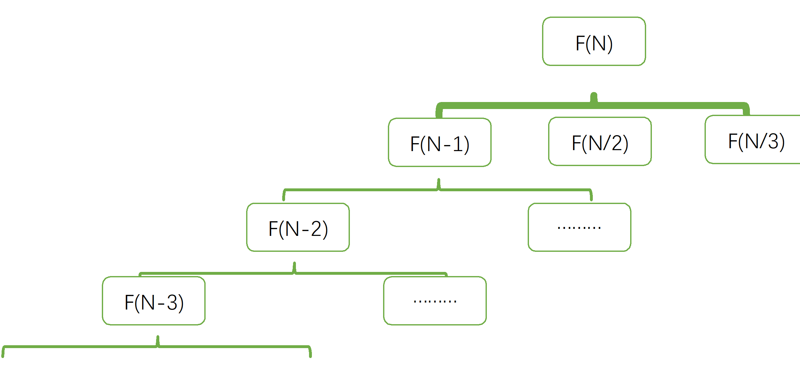
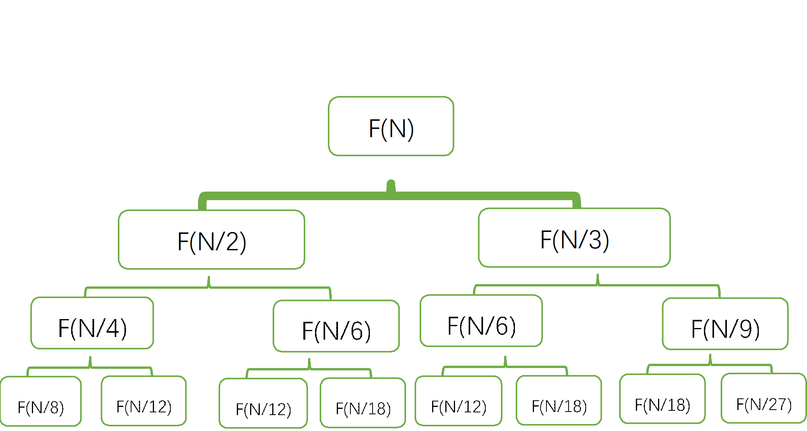
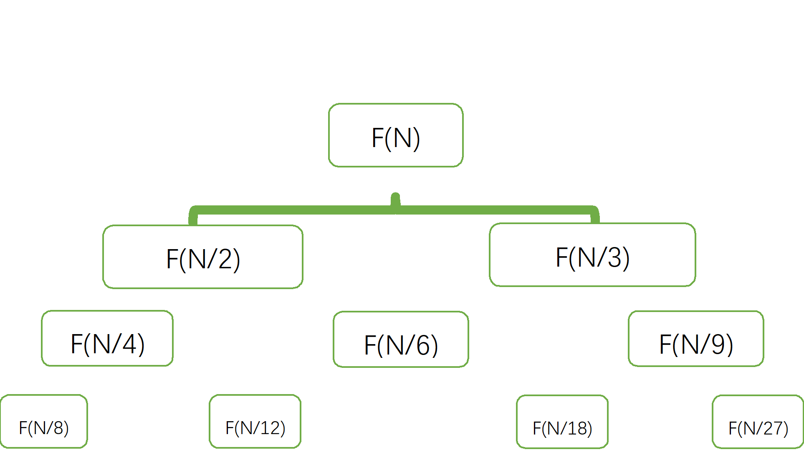

# 1. 题目
厨房里总共有 n 个橘子，你决定每一天选择如下方式之一吃这些橘子：
- 吃掉一个橘子。
- 如果剩余橘子数 n 能被 2 整除，那么你可以吃掉 n/2 个橘子。
- 如果剩余橘子数 n 能被 3 整除，那么你可以吃掉 2*(n/3) 个橘子。
每天你只能从以上 3 种方案中选择一种方案。

请你返回吃掉所有 n 个橘子的最少天数。

<pre>
示例 1：
输入：n = 10
输出：4
解释：你总共有 10 个橘子。
第 1 天：吃 1 个橘子，剩余橘子数 10 - 1 = 9。
第 2 天：吃 6 个橘子，剩余橘子数 9 - 2*(9/3) = 9 - 6 = 3。（9 可以被 3 整除）
第 3 天：吃 2 个橘子，剩余橘子数 3 - 2*(3/3) = 3 - 2 = 1。
第 4 天：吃掉最后 1 个橘子，剩余橘子数 1 - 1 = 0。
你需要至少 4 天吃掉 10 个橘子。

示例 2：
输入：n = 6
输出：3
解释：你总共有 6 个橘子。
第 1 天：吃 3 个橘子，剩余橘子数 6 - 6/2 = 6 - 3 = 3。（6 可以被 2 整除）
第 2 天：吃 2 个橘子，剩余橘子数 3 - 2*(3/3) = 3 - 2 = 1。（3 可以被 3 整除）
第 3 天：吃掉剩余 1 个橘子，剩余橘子数 1 - 1 = 0。
你至少需要 3 天吃掉 6 个橘子。

示例 3：
输入：n = 1
输出：1

示例 4：
输入：n = 56
输出：6
</pre>

# 2. 解析
## 2.1 暴力递推
我们可以容易地想出一种递推的做法。设 $f(i)$ 表示吃完 $i$ 个橘子需要的最少时间，则有递推式:

$f(i)=\lbrace\{\begin{array}{ll}1, & 
i=1 \\ \min \{f(i-1), f(i / 2), f(i / 3)\}+1, & 
i \text { 是 } 6 \text { 的倍数 } \\ \min \{f(i-1), f(i / 2)\}+1, & 
i \text { 是 } 2 \text { 的倍数 } \\ \min \{f(i-1), f(i / 3)\}+1, & 
i \text { 是 } 3 \text { 的倍数 } \\ f(i-1)+1, & 
\text { 其它情况 }\end{array}.\rbrace$


那么，我们只需要从小到大进行遍历$i$计算出$f(i)$，但是这种做法的复杂度为$O(3^n)$，而题目当中的$n$最大值为 $2*10^9 $，所以时间上的限制是明显的。如图，遍历了所有小于N的节点，但是大多数都是无效的。即使通过记忆化搜索，时间复杂度也是 $O(n)$，虽然已经很不错了，但是由于n的值过大，极端情况下仍然存在无法AC的情况。



以下是代码，大部分数据能过，但是肯定不能完全通过
```c++
class Solution {
public:
    int minDays(int n) {
    	vector<int> dp(n+1, INT_MAX);
    	dp[0] = 0;
    	for(int i = 0; i < n; ++i)
    	{
    		if(dp[i] == INT_MAX)
    			continue;
    		dp[i+1] = min(dp[i+1], dp[i]+1);//吃一个
    		if((n-i)%2 == 0)
    			dp[i+(n-i)/2] = min(dp[i+(n-i)/2], dp[i]+1);
    		if((n-i)%3 == 0)
    			dp[i+2*(n-i)/3] = min(dp[i+2*(n-i)/3], dp[i]+1);
    	}
    	return dp[n];
    }
};
```
## 2.2 贪心策略+记忆化
我们再次观察一下，当 n > 0，

1）假如路径全是由 -1 组成的 => 这种情况下到 0 的距离为 n

2）假如某条路径不只是由 -1 组成的，经过了 k 次 -1 然后出现了 /3。此时 (n-k) 一定是 3 的倍数。这条路径从 n 到 (n-k)/3 经过了 (k+1) 条边。我们证明以下结论：
**如果 k >= 3，那么这条路径一定不是最优的。**
可以替换为路径：我们先进行 (k-3) 次 -1，再进行 1 次 /3，再进行 1 次 -1，同样得到 (n-k)/3。但是只用了 (k-1) 条边。
于是如果最优路径是 -1 再 /3，那么 -1 的次数必然 < 3:
当 n % 3 == 0 时，k 可以为 0,3,6,9,... 我们只用考虑 k == 0 的路径
当 n % 3 == 1 时，k 可以为 1,4,7,10,... 我们只用考虑 k == 1 的路径
当 n % 3 == 2 时，k 可以为 2,5,8,11,... 我们只用考虑 k == 2 的路径

3）同理 2，假如某条路径不只是由 -1 组成的，经过了 k 次 -1 然后出现了 /2。 此时 (n-k) 一定是 2 的倍数。这条路径从 n 到 (n-k)/2 经过了 (k+1) 条边。我们证明以下结论：
**如果 k >= 2，那么这条路径一定不是最优的。**
可以替换为路径：我们先进行 (k-2) 次 -1，再进行 1 次 /2'，再进行 1 次 -1，同样得到 (n-k)/2。 但是只用了 k 条边。
于是如果最优路径是 -1 再 /2，那么 '-1' 的次数必然 < 2。
当 n % 2 == 0 时，k 可以为 0,2,4,6,... 我们只用考虑 k == 0 的路径
当 n % 2 == 1 时，k 可以为 1,3,5,7,... 我们只用考虑 k == 1 的路径

所以，以上的结论可以辅助我们做出一个决定，一个个吃必然没有2个、3个吃更加有效。转移方程就变为$f(n) = 1+min(f(n/2)+n%2, f(n/3)+n%3)$

```c++
class Solution {
public:
    map<int,int>mp;
    int dfs(int i){
        if(i==0)return 0;
        if(i==1)return 1;
        if(mp.count(i))return mp[i];
        return mp[i]=min(dfs(i/2)+i%2+1,dfs(i/3)+i%3+1);
    }
    int minDays(int n) {
        mp.clear();
        return dfs(n);
    }

};
```

为什么要加上记忆化呢？没有加上记忆化的结构如下,少了很多重复递归的节点，直接map就可以完成。



而加上了记忆化的结构如下：



复杂度分析：
- 时间复杂度为$T(n)=T(n/2)+T(n/3)+O(1)$，加上记忆化，深度为$log(n)$，于是要遍历的节点数为$O(log^2n)$
- 空间复杂度：$O(log^2 n)$，即为需要存储的 $f(i)$ 的个数。
