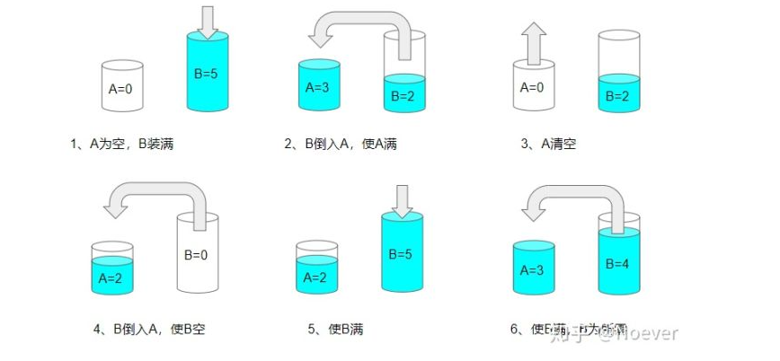

# 1. 题目
有两个容量分别为$x$升和$y$升的水壶以及无限多的水。请判断能否通过使用这两个水壶，从而可以得到恰好$z$升的水？
如果可以，最后请用以上水壶中的一或两个来盛放取得的$z$升水。

你允许：
- 装满任意一个水壶
- 清空任意一个水壶
- 从一个水壶向另外一个水壶倒水，直到装满或者倒空

<pre>
示例 1: 
输入: x = 3, y = 5, z = 4
输出: True

示例 2:
输入: x = 2, y = 6, z = 5
输出: False
</pre>

# 2. 解析
## 2.1 深度优先搜索/回溯
首先对题目进行建模。观察题目可知，在任意一个时刻，此问题的状态可以由两个数字决定：X 壶中的水量，以及 Y 壶中的水量。

在任意一个时刻，我们可以且仅可以采取以下几种操作：
- 把 X 壶的水灌进 Y 壶，直至灌满或倒空；
- 把 Y 壶的水灌进 X 壶，直至灌满或倒空；
- 把 X 壶灌满；
- 把 Y 壶灌满；
- 把 X 壶倒空；
- 把 Y 壶倒空。
因此，本题可以使用深度优先搜索来解决。搜索中的每一步以 `remain_x, remain_y` 作为状态，即表示 X 壶和 Y 壶中的水量。在每一步搜索时，我们会依次尝试所有的操作，递归地搜索下去。这可能会导致我们陷入无止境的递归，因此我们还需要使用一个哈希结合（HashSet）存储所有已经搜索过的 `remain_x, remain_y `状态，保证每个状态至多只被搜索一次
```c++
using PII = pair<int, int>;

class Solution {
public:
    bool canMeasureWater(int x, int y, int z) {
        stack<PII> stk;
        stk.emplace(0, 0);
        auto hash_function = [](const PII& o) {return hash<int>()(o.first) ^ hash<int>()(o.second);};
        unordered_set<PII, decltype(hash_function)> seen(0, hash_function);
        while (!stk.empty()) {
            if (seen.count(stk.top())) {
                stk.pop();
                continue;
            }
            seen.emplace(stk.top());
            
            auto [remain_x, remain_y] = stk.top();
            stk.pop();
            if (remain_x == z || remain_y == z || remain_x + remain_y == z) {
                return true;
            }
            // 把 X 壶灌满。
            stk.emplace(x, remain_y);
            // 把 Y 壶灌满。
            stk.emplace(remain_x, y);
            // 把 X 壶倒空。
            stk.emplace(0, remain_y);
            // 把 Y 壶倒空。
            stk.emplace(remain_x, 0);
            // 把 X 壶的水灌进 Y 壶，直至灌满或倒空。
            stk.emplace(remain_x - min(remain_x, y - remain_y), remain_y + min(remain_x, y - remain_y));
            // 把 Y 壶的水灌进 X 壶，直至灌满或倒空。
            stk.emplace(remain_x + min(remain_y, x - remain_x), remain_y - min(remain_y, x - remain_x));
        }
        return false;
    }
};
```
复杂度分析
- 时间复杂度：$O(xy)$，状态数最多有 $(x+1)(y+1)$ 种，对每一种状态进行深度优先搜索的时间复杂度为 $O(1)$，因此总时间复杂度为 $O(xy)$。
- 空间复杂度：$O(xy)$，由于状态数最多有 $(x+1)(y+1)$ 种，哈希集合中最多会有 $(x+1)(y+1)$ 项，因此空间复杂度为 $O(xy)$。


## 2.2 数学方法--贝祖定理

我们知道每次操作只会让桶里的水总量增加 $x$，增加 $y$，减少 $x$，或者减少 $y$。

你可能认为这有问题：如果往一个不满的桶里放水，或者把它排空呢？那变化量不就不是 $x$ 或者 $y$ 了吗？接下来我们来解释这一点：

首先要清楚，在题目所给的操作下，两个桶不可能同时有水且不满。因为观察所有题目中的操作，操作的结果都至少有一个桶是空的或者满的；

其次，对一个不满的桶加水是没有意义的。因为如果另一个桶是空的，那么这个操作的结果等价于直接从初始状态给这个桶加满水；而如果另一个桶是满的，那么这个操作的结果等价于从初始状态分别给两个桶加满；

再次，把一个不满的桶里面的水倒掉是没有意义的。因为如果另一个桶是空的，那么这个操作的结果等价于回到初始状态；而如果另一个桶是满的，那么这个操作的结果等价于从初始状态直接给另一个桶倒满。

因此，我们可以认为每次操作只会给水的总量带来 $x$ 或者 $y$ 的变化量。因此我们的目标可以改写成：找到一对整数 $a, b$ 使得 $ax+by=z$，而只要满足 $z≤x+y$，且这样的 $a, b$ 存在，那么我们的目标就是可以达成的。这是因为：若 $a≥0,b≥0$，那么显然可以达成目标。推导如下：

若 $a<0$，那么可以进行以下操作：
1) 往 y 壶倒水；
2) 把 y 壶的水倒入 x 壶；
3) 如果 y 壶不为空，那么 x 壶肯定是满的，把 x 壶倒空，然后再把 y 壶的水倒入 x 壶。
4) 重复以上操作直至某一步时 x 壶进行了 a 次倒空操作，y 壶进行了 b 次倒水操作。

若$b<0$，方法同上，$x 与 y$ 互换。

具体的操作看下图：


而贝祖定理告诉我们， $ax+by=z$ 有解当且仅当 $z$ 是 $x, y$的最大公约数的倍数。因此我们只需要找到 $x, y$ 的最大公约数并判断 $z$ 是否是它的倍数即可。

```c++
class Solution {
public:
    bool canMeasureWater(int x, int y, int z) {
        if (x + y < z) {
            return false;
        }
        if (x == 0 || y == 0) {
            return z == 0 || x + y == z;
        }
        return z % gcd(x, y) == 0;
    }
};
```
