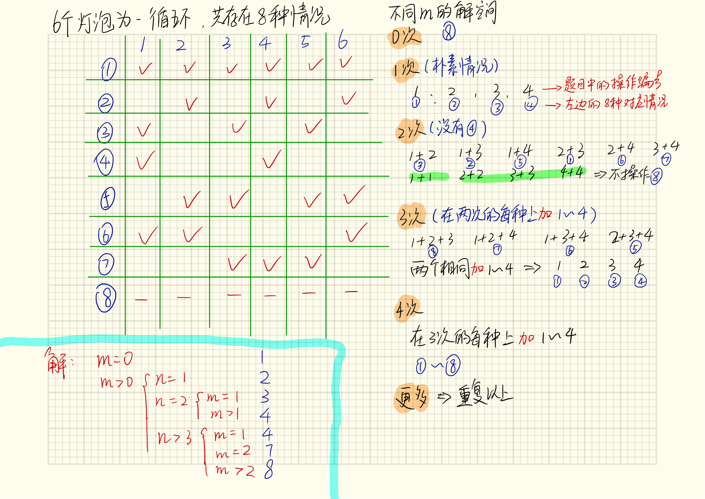

# 1. 问题
现有一个房间，墙上挂有 n 只已经打开的灯泡和 4 个按钮。在进行了 m 次未知操作后，你需要返回这 n 只灯泡可能有多少种不同的状态。
假设这 n 只灯泡被编号为 [1, 2, 3 ..., n]，这 4 个按钮的功能如下：
- 将所有灯泡的状态反转（即开变为关，关变为开）
- 将编号为偶数的灯泡的状态反转
- 将编号为奇数的灯泡的状态反转
- 将编号为 3k^1 的灯泡的状态反转（k = 0, 1, 2, ...)

<pre>
示例 1:
输入: n = 1, m = 1.
输出: 2
说明: 状态为: [开], [关]

示例 2:
输入: n = 2, m = 1.
输出: 3
说明: 状态为: [开, 关], [关, 开], [关, 关]

示例 3:
输入: n = 3, m = 1.
输出: 4
说明: 状态为: [关, 开, 关], [开, 关, 开], [关, 关, 关], [关, 开, 开].
</pre>

# 2. 解析
## 2.1 认知
下图分析了6个灯泡的所有情况：



从图中可以清晰的看到，如果灯泡数量多于6个，那就是重复循环前6个灯泡的状况。如下我们开始理论分析。

## 2.2 题目解答
由于搜索空间非常大（$2^N$个灯光的状态，$4^M$个操作顺序 ），让我们尝试减少它。

前6个灯唯一地决定了其余的灯。这是因为每一个修改 第 $x$ 的灯光的操作都会修改第 $(x^6)$ 的灯光。

**首先简化m**

进行 A 操作后接 B 操作 和 B 操作后接 A 操作是一样的，所以我们可以假设我们按顺序进行所有操作。

最后，连续两次执行相同的操作与不执行任何操作相同。所以我们只需要考虑每个操作是 0 次还是 1 次。

**其次简化n**

有如下四个操作并设为a,b,c,d
a. 将所有灯泡的状态反转（即开变为关，关变为开）
b. 将编号为偶数的灯泡的状态反转
c. 将编号为奇数的灯泡的状态反转
d. 将编号为 3k^1 的灯泡的状态反转（k = 0, 1, 2, ...)

设 $a,b,c,d$为四种操作已经执行，$!a,!b,!c,!d$为四种操作未执行,其中由于前6个灯唯一地决定了其余的灯，我们将简化到6。

假设n > 6，所有灯泡已经初始为开，可以看到对于所有状态为灯泡有（这一部分也可以解释为什么前6个灯决定了其余的灯）
<pre>
Light 1 = true ^ a ^ c ^ d
Light 2 = true ^ a ^ b
Light 3 = true ^ a ^ c
Light 4 = true ^ a ^ b ^ d
Light 5 = true ^ a ^ c
Light 6 = true ^ a ^ b
=========== 重复1~6 ==============
Light 7 = true ^ a ^ c ^ d
Light 8 = true ^ a ^ b
Light 9 = true ^ a ^ c
Light 10 = true ^ a ^ b ^ d
</pre>

可以发现，第$i$个灯泡的状态 = 第 $i \% 6$ 个灯泡的状态。简单看四个操作的最小公约数也可以求得循环，此时可以求前6个灯泡的所有状态即可。

**然后再简化到3**

假设 n>3 进一步思考可以发现，决定所有灯泡的操作为abcd，如果前三个灯泡的状态确定了，就可以得到个四元一次方程，就可以确定abcd的操作是否执行，即前三个灯泡的状态可以决定后续所有灯泡的状态。证明如下：
<pre>
Light 1 = 1 ^ a ^ c ^ d
Light 2 = 1 ^ a ^ b
Light 3 = 1 ^ a ^ c
Light 4 = 1 ^ a ^ b ^ d
Light 5 = 1 ^ a ^ c
Light 6 = 1 ^ a ^ b
</pre>
上述理由表明，在不损失一般性的情况下，取 $n = min(n, 3)$ 是合理的。

前三个灯泡的状态共有8种，即后续灯泡的状态都由8种决定，所有灯泡的状态也最多只有8种。

让我们用 (a,b,c) 来表示灯的状态。与值为 (1, 1, 1), (0, 1, 0), (1, 0, 1), (1, 0, 0) xor。
- 当 m=0 时，所有灯都亮起，只有一个状态 (1, 1, 1)。在这种情况下，答案总是 1。
- 当 m=1 时，我们可以得到状态 (0, 0, 0), (1, 0, 1), (0, 1, 0), (0, 1, 1)。在这种情况下，对于 n = 1, 2, 3 的答案是 2, 3, 4。
- 当 m=2 时，我们可以检查是否可以获得 7 个状态：除(0, 1, 1)之外的所有状态。在这种情况下，n = 1, 2, 3 的答案是 2, 4, 7。
- 当 m=3时，我们可以得到所有 8 个状态。在这种情况下，n = 1, 2, 3 的答案是 2, 4, 8。

于是，代码就变得很好写了：
```c++
class Solution {
public:
    int flipLights(int n, int m) {
        n = min(n, 3);
        if (m == 0) return 1;
        if (m == 1) return n == 1 ? 2 : n == 2 ? 3 : 4;
        if (m == 2) return n == 1 ? 2 : n == 2 ? 4 : 7;
        return n == 1 ? 2 : n == 2 ? 4 : 8;
    }
};
```
