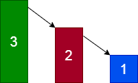
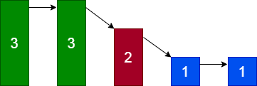

# 1. 问题
假设有 n 台超级洗衣机放在同一排上。开始的时候，每台洗衣机内可能有一定量的衣服，也可能是空的。
在每一步操作中，你可以选择任意 $m （1 ≤ m ≤ n）$ 台洗衣机，与此同时将每台洗衣机的一件衣服送到相邻的一台洗衣机。
给定一个非负整数数组代表从左至右每台洗衣机中的衣物数量，请给出能让所有洗衣机中剩下的衣物的数量相等的最少的操作步数。如果不能使每台洗衣机中衣物的数量相等，则返回 -1。

<pre>
示例 1：
输入: [1,0,5]
输出: 3
解释: 
第一步:    1     0 <-- 5    =>    1     1     4
第二步:    1 <-- 1 <-- 4    =>    2     1     3    
第三步:    2     1 <-- 3    =>    2     2     2   

示例 2：
输入: [0,3,0]
输出: 2
解释: 
第一步:    0 <-- 3     0    =>    1     2     0    
第二步:    1     2 --> 0    =>    1     1     1     

示例 3:
输入: [0,2,0]
输出: -1
解释: 
不可能让所有三个洗衣机同时剩下相同数量的衣物。
</pre>

# 2. 解析
1、记总的衣服为sum，那么显然sum不能整除n的情况下无解。最后相等的数量为average = sum / n。

2、先从最简单的情况入手，[3,2,1]应该怎么选？当然是选择[3,2]，3传递一个给2,2传递一个给1，只需一次操作就平衡了。我们发现，这是一个水往低处流的过程，虽然我们的目标是从3里面给一个给1，但是中间已经平衡的2也被迫选上。这说明一旦一个洗衣机已经平衡，那么如果有衣服想经过它，就必须把这台洗衣机选上。否则只会花费更多的步骤让它重新平衡。



3、想明白上面一点， 我们就能进一步发现，所有洗衣机平衡的方法只有两种情况：
第一种，多、少衣服的洗衣机在两边：



第二种，少衣服的洗衣机在两边，最多衣服的洗衣机在中间


先看第一种情况。在5将两件衣服传递到右边之前，4是不会改变的，这需要两步。然后4将一件衣服传递到右边，总的步骤是3步。所以它等价于：


当我们考察第二个洗衣机时，可以将1、2两个洗衣机合并，左边一共多了3件衣服(最后平均每个为3件，所以是5+4-3*2=3)，这3件都要传递到右边去。更进一步，我们在任意位置画一条虚线，假设它左边有$left$件衣服，右边有$right$件衣服，平衡状态下左边应该是$left'$件衣服，那么左边多了$left-left'$件衣服，这些衣服需要流动到右边去。当我们遍历所有的虚线位置，其中最大的一个$max(left-left')$就是答案。这个答案必要性是显而易见的，每次只能流动一件衣服，而左边多了$left-left'$件，所以至少需要这么多次流动步骤。那么这些衣服流动到右边以后，就可以将右边变平衡。如下图：


然后假设右边有一个$Y$大于average，那么它必然不能紧挨着左边的X，因为紧挨的情况下，Y位置的$left-left'$必然大于X位置的$left-left'$，这样$max(left-left')$就是$Y$了。


那么X和Y之间如果有小于average的Z呢？我们肯定要先从X流动衣服到Z，于此同时，为了减少操作步骤，我们要从Y流动衣服到更右边的地方。关键是，当Z平衡的时候，Y一定已经先平衡了，否则就变成了Y紧挨着X的情况，又矛盾了。而Y平衡以后，就变成了X往右分发的情况，一定能够完成。


搞清楚第一种情况以后，第二种情况就更容易理解了，把最多衣服的洗衣机想象成一个真正的超级洗衣机，左右两边的洗衣机都等着它分发衣服就可以了。

```c++
class Solution {
public:
    int findMinMoves(vector<int>& machines) {
        int i, size = machines.size(), sum = getSum(machines), average = sum / size;
        if (average * size != sum) {
            return -1;
        }

        int left = machines[0], wantedLeft = average, right, wantedRight = average * (size - 2);
        int minMoves = max(abs(machines[0] - average), abs(machines[size - 1] - average));

        for (i = 1; i < size - 1; ++i) {
            int num = machines[i];
            right = sum - num - left;

            if (num >= average) {
                int moves = num - average;
                if (left > wantedLeft) {
                    moves += (left - wantedLeft);
                }
                if (right > wantedRight) {
                    moves += (right - wantedRight);
                }
                minMoves = max(minMoves, moves);

            }

            left += num;
            wantedLeft += average;
            wantedRight -= average;
        }

        return minMoves;
    }

    int getSum(vector<int>& machines) {
        int sum = 0;

        for (int num : machines) {
            sum += num;
        }

        return sum;
    }
};
```

复杂度分析
- 时间复杂度：O(N)。
- 空间复杂度：O(1)。
